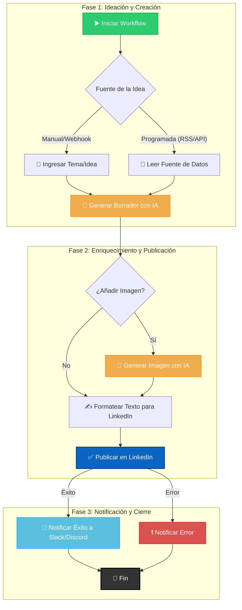

# 🤖 n8n LinkedIn Content Automation


<div align="center">

**Un conjunto de workflows de n8n para automatizar la creación y publicación de contenido en LinkedIn usando IA.**

</div>

<div align="center">

[](https://opensource.org/licenses/MIT)
[](https://github.com/renebell0/n8n-linkedin-content/issues)
[](https://github.com/renebell0/n8n-linkedin-content/network)
[](https://github.com/renebell0/n8n-linkedin-content/stargazers)

</div>

---

## 📖 Tabla de Contenidos

1.  [El Problema](#-el-problema)
2.  [La Solución](#-la-solución)
3.  [Características Destacadas](#-características-destacadas)
4.  [Tecnologías Utilizadas](#-tecnologías-utilizadas)
5.  [Flujo de Trabajo Visual](#-flujo-de-trabajo-visual)
6.  [Empezando](#-empezando)
7.  [Uso y Ejemplos](#-uso-y-ejemplos)
8.  [Estructura del Repositorio](#-estructura-del-repositorio)
9.  [Roadmap](#-roadmap)
10. [Cómo Contribuir](#-cómo-contribuir)
11. [Licencia](#-licencia)

---

## 🎯 El Problema

Mantener una presencia activa y relevante en LinkedIn exige un flujo constante de contenido de calidad. Este proceso es manual, repetitivo y consume una cantidad significativa de tiempo que podría dedicarse a la estrategia, el networking y la interacción con la comunidad.

## 💡 La Solución

Este proyecto ofrece una solución de **automatización de extremo a extremo** construida en **n8n**. Transforma una simple idea en una publicación de LinkedIn completamente formateada y lista para publicar, con texto e imágenes generados por IA.

> **Nuestra misión:** Liberarte de las tareas operativas para que puedas centrarte en lo que realmente importa: aportar valor y construir relaciones.

---

## ✨ Características Destacadas

-   **🤖 Generación de Contenido con IA:** Usa OpenAI (o modelos similares) para crear borradores de publicaciones a partir de un tema.
-   **🎨 Creación de Imágenes:** Genera automáticamente imágenes de acompañamiento para tus posts.
-   **🧩 Flujo de Trabajo Modular:** Workflows personalizables y fáciles de adaptar a tus necesidades.
-   **🗓️ Programación Inteligente:** Publica inmediatamente o programa para el mejor momento.
-   **🔔 Notificaciones Integradas:** Recibe alertas sobre el estado de tus publicaciones (éxito o error).
-   **🔌 Múltiples Fuentes de Datos:** Diseñado para leer ideas desde Google Sheets, Airtable, RSS, o APIs externas.

---

## 🔧 Tecnologías Utilizadas


---

## 📊 Flujo de Trabajo Visual

El proceso transforma una idea en una publicación finalizada en LinkedIn de manera lógica y automatizada.



---

## 🏁 Empezando

### Requisitos Previos

Asegúrate de tener acceso a:
1.  **Una instancia de n8n:** [n8n.cloud](https://n8n.cloud/) (recomendado) o auto-alojada.
2.  **Credenciales de LinkedIn:** Acceso OAuth2 para publicar en tu nombre.
3.  **API Key de OpenAI (o similar):** Para la generación de contenido.

### Instalación

1.  **Clona el repositorio:**
    ```bash
    git clone [https://github.com/renebell0/n8n-linkedin-content.git](https://github.com/renebell0/n8n-linkedin-content.git)
    ```
2.  **Importa el Workflow en n8n:**
    -   En tu panel de n8n, ve a `Workflows`.
    -   Haz clic en `Import from File` y selecciona el archivo `.json` del workflow.
3.  **Configura las Credenciales:**
    -   Dentro de n8n, ve a la sección `Credentials`.
    -   Configura las credenciales para `LinkedIn` y `OpenAI`, siguiendo las instrucciones de cada nodo en el workflow.
4.  **Activa el Workflow:**
    -   Abre el workflow, revisa que los nodos estén correctamente configurados y actívalo con el interruptor en la esquina superior derecha. ¡Listo!

---

## 🕹️ Uso y Ejemplos

Puedes disparar el workflow de varias maneras. Aquí un ejemplo manual:

1.  **Nodo de Inicio (Manual):**
    -   Proporciona un tema simple como entrada. Por ejemplo:
        ```json
        {
          "topic": "La importancia de la automatización para equipos de marketing pequeños."
        }
        ```
2.  **Nodo de OpenAI:**
    -   El workflow enviará este tema a la IA con un prompt predefinido para generar un post.
    -   **Ejemplo de Prompt (dentro del nodo):**
        > "Actúa como un experto en marketing B2B. Escribe un post para LinkedIn de 3 párrafos sobre el tema: '{{$json.topic}}'. Usa emojis relevantes y finaliza con una pregunta para fomentar la interacción."
3.  **Resultado Final:**
    -   El workflow publicará en LinkedIn un post formateado y, opcionalmente, una imagen relacionada.

---

## 📂 Estructura del Repositorio

```
.
├── workflows/
│   ├── linkedin_content_generator.json  # Workflow principal
│   └── ... (otros workflows)
├── .gitignore
├── LICENSE
└── README.md
```
-   **`workflows/`**: Contiene todos los archivos `.json` de los workflows de n8n.
-   **`LICENSE`**: La licencia del proyecto.
-   **`README.md`**: La documentación que estás leyendo.

---

## 🗺️ Roadmap

Aquí hay algunas ideas para el futuro de este proyecto. ¡Las contribuciones son bienvenidas!

-   [ ] **Integración con Buffer/Hootsuite:** Añadir nodos para programar a través de otras plataformas.
-   [ ] **Análisis de Sentimiento:** Analizar el tema antes de escribir para ajustar el tono.
-   [ ] **Generación de Hilos (Threads):** Adaptar el workflow para crear hilos en lugar de posts únicos.
-   [ ] **Workflow de Curación de Contenido:** Un nuevo workflow para encontrar y compartir noticias relevantes del sector.

---

## 🤝 Cómo Contribuir

Las contribuciones hacen que la comunidad de código abierto sea un lugar increíble para aprender, inspirar y crear. Cualquier contribución que hagas será **muy apreciada**.

1.  Haz un **Fork** del proyecto.
2.  Crea tu rama de funcionalidad (`git checkout -b feature/AmazingFeature`).
3.  Haz commit de tus cambios (`git commit -m 'Add some AmazingFeature'`).
4.  Haz push a la rama (`git push origin feature/AmazingFeature`).
5.  Abre un **Pull Request**.

---

## 📄 Licencia

Distribuido bajo la Licencia MIT. Consulta el archivo `LICENSE` para más información.
